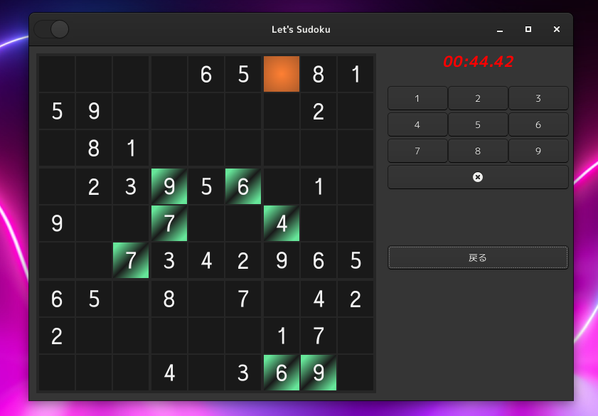

Aho-Sudoku
====================================================================================================
This is a game application of SUDOKU (数独).

The rule is simple: There is 9 x 9 cells in a field.
Cells are divided into 3 x 3 blocks.
You should put numbers from 1 to 9 in all cells.
And you are not allowed to put the same numbers in one rows, columns, and 3 x 3 blocks at the same
time.
Can you understand reading this explanation?
If no, Google will help you.

Caution: There are combinations of numbers that are correct, but I can't say that you can always
guess by looking at the numbers you see.

We strongly recommend that you do not play this game seriously. 

### Dark Mode

It can be in a dark mode.

### Hexadecimal mode
Pressing a button on the top-left corner, you can switch the game to “Hexadecimal mode”.

In this mode, 16 numbers (1, 2, 3, 4, 5, 6, 7, 8, 9, A, B, C, D, E, F) can be selected.

Field will be 16 x 16 cells.

I don’t want to play this though.

I recommend you to take it as an interia.

### Executable file (AppImage)

You can play this game without compiling by downloading AppImage file.  
Download page: [Release page](https://github.com/aharotias2/aho-sudoku/releases).  
You should enable executable flag of property of the downloaded file.

### How to execute

| long option | short option | description          |
|-------------|--------------|----------------------|
| help        | h            | print help           |
| version     | v            | print version        |
| debug       | d            | launch in debug mode |

***

Copyright © 2021 Takayuki Tanaka (田中喬之)
