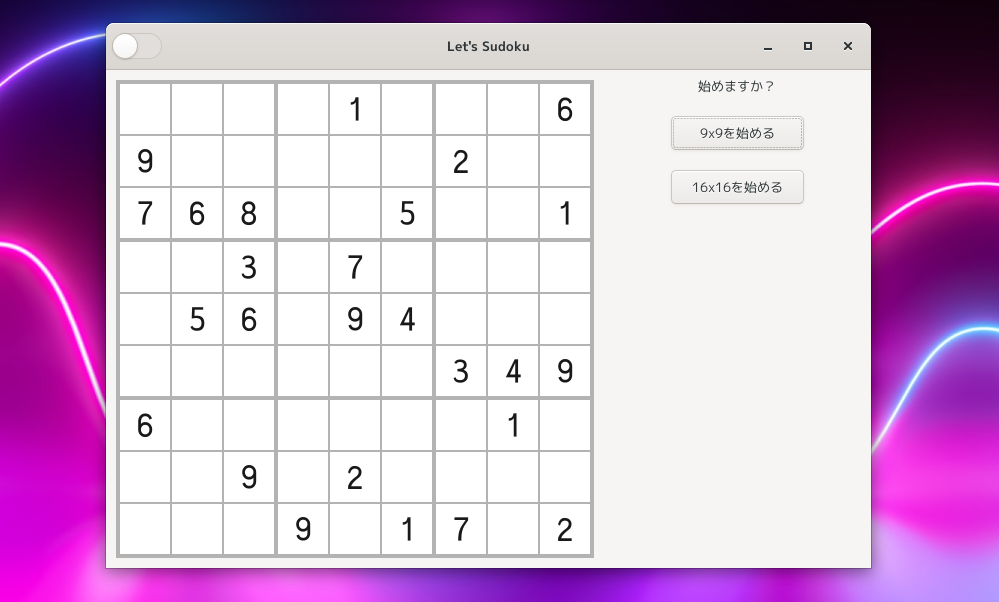

Aho-Sudoku
====================================================================================================
解けるかわからないアホな数独デスクトップアプリケーション。

一応、正解はあるのですが、見えている数字から推測して本当に解けるのかは不明です。

くれぐれも、真剣にプレイしないでください。

### ダークモード

ダークモードはじめました。

### 16進法モード
左上のスイッチをオンにしますと16進法 (0, 1, 2, 3, 4, 5, 6, 7, 8, 9, A, B, C, D, E, F) モードになりま
す。

これは私もやりたくありませんので、やはりプレイしない方が良いと思います。

インテリアのようなものと思っていただければと思います。

### 実行ファイル

ちなみに下記リンクをダウンロードすればコンパイル作業なしでプレイできます。
実行権限をオンにして実行できます。(コマンドラインから)

<https://drive.google.com/file/d/1vsqiOV6vLCcRRAzG1e5_GQc4Znbx3aMM/view?usp=sharing>

* MD5SUM: bc4e08c60df8a386b8c33659412fd997
* SHA256SUM: 1b6bf44c546571f8ac5815dab59556a2c977a930f2785e632c7b19446fbc4ce7

### 実行方法

| オプション | 短かいオプション | 説明                                              |
|------------|------------------|---------------------------------------------------|
| help       | h                | ヘルプを表示                                      |
| version    | v                | バージョンを表示                                  |
| debug      | d                | デバッグモードで起動 (デバッグボタンが表示される) |

***

Copyright © 2021 田中喬之
