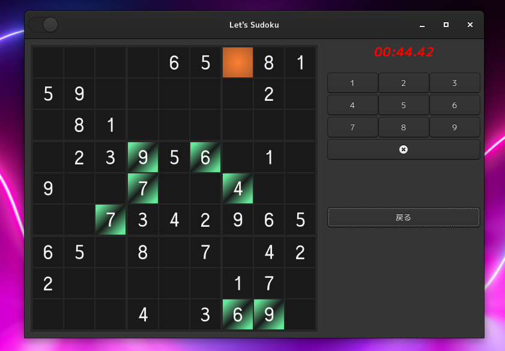
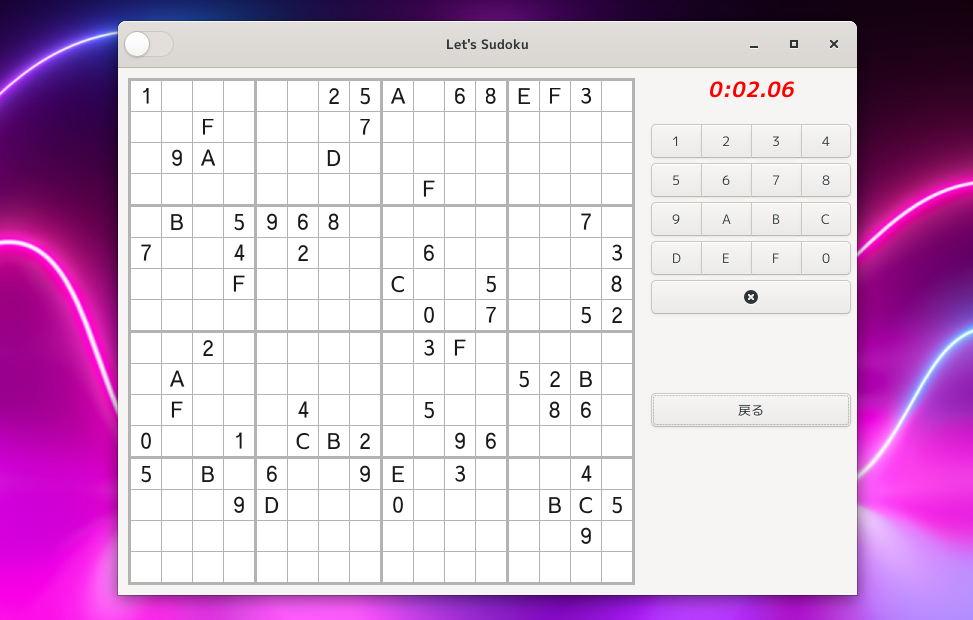

Aho-Sudoku
====================================================================================================
解けるかわからないアホな数独デスクトップアプリケーション。

一応、正解はあるのですが、見えている数字から推測して本当に解けるのかは不明です。

くれぐれも、真剣にプレイしないでください。

### ダークモード

ダークモードはじめました。

### 16進法モード
左上のスイッチをオンにしますと16進法 (0, 1, 2, 3, 4, 5, 6, 7, 8, 9, A, B, C, D, E, F) モードになりま
す。

これは私もやりたくありませんので、やはりプレイしない方が良いと思います。

インテリアのようなものと思っていただければと思います。

### 実行ファイル (AppImage)

ちなみにAppImageをダウンロードすればコンパイル作業なしでプレイできます。
ダウンロードは[リリースページ](https://github.com/aharotias2/aho-sudoku/releases)からできます。
実行権限をオンにしてダブルクリックで実行できます。

### 実行方法

| オプション | 短かいオプション | 説明                                              |
|------------|------------------|---------------------------------------------------|
| help       | h                | ヘルプを表示                                      |
| version    | v                | バージョンを表示                                  |
| debug      | d                | デバッグモードで起動 (デバッグボタンが表示される) |

***

Copyright © 2021 田中喬之
